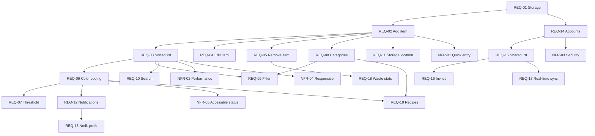

# Food Tracker – Initial Requirements Backlog

This backlog represents the outcome of an initial pass of requirements elicitation for the Food Tracker project, an app that helps households reduce food waste by tracking items and their expiration dates.

**Model used:** Claude (Anthropic)

**Prompt used:**
> I am building a food tracking app for a software engineering course using Scrum. Users enter items in their fridge or pantry with expiration dates. The app shows items sorted by what expires soonest, with color coding for items close to expiring. Later features include reminder notifications, food categories, a shared household list, and, as a stretch goal, recipe suggestions based on expiring ingredients. Create a product backlog representing an initial pass of requirements elicitation. Write functional requirements as user stories and include non-functional requirements. Tag each requirement with metadata (ID, epic, type, priority, estimate, target sprint) and identify dependencies between requirements. Include acceptance criteria for each.

---

## Metadata Key

| Field | Values |
|---|---|
| **Type** | Functional (F), Non-Functional (NF), Technical (T) |
| **Priority** | MoSCoW: Must, Should, Could, Won't (this term) |
| **Estimate** | Story points (Fibonacci: 1, 2, 3, 5, 8, 13) |
| **Sprint** | Suggested target sprint (S1–S5); "Stretch" = only if time allows |

## Epics

| Epic | Name | Description |
|---|---|---|
| E1 | Core Inventory | Adding, viewing, editing, and removing food items |
| E2 | Organization | Categories, storage locations, filtering, and search |
| E3 | Notifications | Reminders about items nearing expiration |
| E4 | Accounts & Sharing | User accounts and shared household lists |
| E5 | Insights & Recipes | Waste statistics and recipe suggestions |
| E6 | Quality Attributes | Usability, performance, security, accessibility |

---

## Backlog Summary

| ID | Title | Epic | Type | Priority | Est. | Sprint | Depends On |
|---|---|---|---|---|---|---|---|
| REQ-01 | Persistent item storage | E1 | T | Must | 3 | S1 | — |
| REQ-02 | Add a food item | E1 | F | Must | 3 | S1 | REQ-01 |
| REQ-03 | View items sorted by expiration | E1 | F | Must | 2 | S1 | REQ-02 |
| REQ-04 | Edit a food item | E1 | F | Must | 2 | S1 | REQ-02 |
| REQ-05 | Remove item (used / discarded) | E1 | F | Must | 2 | S1 | REQ-02 |
| REQ-06 | Color-coded expiration status | E1 | F | Must | 3 | S2 | REQ-03 |
| REQ-07 | Configurable "expiring soon" threshold | E1 | F | Could | 2 | S4 | REQ-06 |
| REQ-08 | Assign food categories | E2 | F | Should | 2 | S2 | REQ-02 |
| REQ-09 | Filter list by category | E2 | F | Should | 2 | S2 | REQ-03, REQ-08 |
| REQ-10 | Search items by name | E2 | F | Could | 2 | S4 | REQ-03 |
| REQ-11 | Track storage location | E2 | F | Could | 2 | S4 | REQ-02 |
| REQ-12 | Expiration reminder notifications | E3 | F | Should | 5 | S3 | REQ-06 |
| REQ-13 | Notification preferences | E3 | F | Could | 3 | S4 | REQ-12 |
| REQ-14 | User registration and login | E4 | F | Should | 5 | S3 | REQ-01 |
| REQ-15 | Create a shared household list | E4 | F | Should | 5 | S4 | REQ-14 |
| REQ-16 | Invite household members | E4 | F | Should | 3 | S4 | REQ-15 |
| REQ-17 | Real-time sync of shared list | E4 | F | Could | 8 | S5 | REQ-15 |
| REQ-18 | Food waste statistics | E5 | F | Could | 5 | S5 | REQ-05 |
| REQ-19 | Recipe suggestions for expiring items | E5 | F | Won't | 8 | Stretch | REQ-06, REQ-08 |
| NFR-01 | Quick item entry | E6 | NF | Must | 2 | S1 | REQ-02 |
| NFR-02 | List load performance | E6 | NF | Should | 2 | S3 | REQ-03 |
| NFR-03 | Account and data security | E6 | NF | Must | 3 | S3 | REQ-14 |
| NFR-04 | Mobile-responsive interface | E6 | NF | Must | 3 | S2 | REQ-03 |
| NFR-05 | Accessible expiration status | E6 | NF | Must | 1 | S2 | REQ-06 |

---

## Detailed Requirements

### E1 – Core Inventory

**REQ-01 – Persistent item storage**
*Type: Technical · Priority: Must · Estimate: 3 · Sprint: S1 · Depends on: none*
The system shall store food item data so it is preserved between sessions.
- Acceptance criteria: Items added by the user are still present after closing and reopening the app. Each item stores at minimum a name, quantity, and expiration date.

**REQ-02 – Add a food item**
*Type: Functional · Priority: Must · Estimate: 3 · Sprint: S1 · Depends on: REQ-01*
As a user, I want to add a food item with its name, quantity, and expiration date so that I can keep track of what I have.
- Acceptance criteria: The user can enter a name, quantity, and expiration date and save the item. The app rejects entries with a missing name or invalid date and shows an error message. The new item appears in the list immediately after saving.

**REQ-03 – View items sorted by expiration**
*Type: Functional · Priority: Must · Estimate: 2 · Sprint: S1 · Depends on: REQ-02*
As a user, I want to see my items sorted by expiration date so that I know what to use first.
- Acceptance criteria: Items are listed with the soonest expiration date at the top. Each entry shows the name, quantity, and expiration date. An empty list shows a helpful message prompting the user to add an item.

**REQ-04 – Edit a food item**
*Type: Functional · Priority: Must · Estimate: 2 · Sprint: S1 · Depends on: REQ-02*
As a user, I want to edit an item's details so that I can fix mistakes or update the quantity.
- Acceptance criteria: The user can change any field of an existing item and save. The list re-sorts if the expiration date changes.

**REQ-05 – Remove item (used / discarded)**
*Type: Functional · Priority: Must · Estimate: 2 · Sprint: S1 · Depends on: REQ-02*
As a user, I want to remove an item and mark whether it was used or thrown away so that my list stays accurate.
- Acceptance criteria: The user can remove an item by marking it "Used" or "Discarded." The outcome is recorded (needed later for REQ-18). The app asks for confirmation before removing.

**REQ-06 – Color-coded expiration status**
*Type: Functional · Priority: Must · Estimate: 3 · Sprint: S2 · Depends on: REQ-03*
As a user, I want items to be color-coded by how close they are to expiring so that I can spot urgent items at a glance.
- Acceptance criteria: Items expiring in more than 3 days are green, within 3 days are yellow, and today or already expired are red. Status updates automatically as dates pass.

**REQ-07 – Configurable "expiring soon" threshold**
*Type: Functional · Priority: Could · Estimate: 2 · Sprint: S4 · Depends on: REQ-06*
As a user, I want to choose how many days counts as "expiring soon" so that the warnings match my habits.
- Acceptance criteria: The user can set the threshold between 1 and 7 days. Color coding updates to reflect the new setting.

### E2 – Organization

**REQ-08 – Assign food categories**
*Type: Functional · Priority: Should · Estimate: 2 · Sprint: S2 · Depends on: REQ-02*
As a user, I want to assign a category (e.g., dairy, produce, meat) to each item so that my list is organized.
- Acceptance criteria: The user can pick a category from a predefined list when adding or editing an item. Items without a category are labeled "Other."

**REQ-09 – Filter list by category**
*Type: Functional · Priority: Should · Estimate: 2 · Sprint: S2 · Depends on: REQ-03, REQ-08*
As a user, I want to filter my list by category so that I can quickly find certain kinds of food.
- Acceptance criteria: Selecting a category shows only items in that category, still sorted by expiration. The user can clear the filter to see all items.

**REQ-10 – Search items by name**
*Type: Functional · Priority: Could · Estimate: 2 · Sprint: S4 · Depends on: REQ-03*
As a user, I want to search my items by name so that I can check whether I already have something.
- Acceptance criteria: Typing in the search box filters the list to items whose names contain the search text (case-insensitive).

**REQ-11 – Track storage location**
*Type: Functional · Priority: Could · Estimate: 2 · Sprint: S4 · Depends on: REQ-02*
As a user, I want to record where an item is stored (fridge, freezer, pantry) so that I know where to find it.
- Acceptance criteria: The user can select a storage location when adding or editing an item, and the location is shown in the list.

### E3 – Notifications

**REQ-12 – Expiration reminder notifications**
*Type: Functional · Priority: Should · Estimate: 5 · Sprint: S3 · Depends on: REQ-06*
As a user, I want to receive a reminder when items are about to expire so that I remember to use them.
- Acceptance criteria: The user receives a notification when an item enters "expiring soon" status. Multiple items expiring on the same day are grouped into one notification.

**REQ-13 – Notification preferences**
*Type: Functional · Priority: Could · Estimate: 3 · Sprint: S4 · Depends on: REQ-12*
As a user, I want to control when and whether I get notifications so that they aren't annoying.
- Acceptance criteria: The user can turn notifications on or off and choose a preferred time of day to receive them.

### E4 – Accounts & Sharing

**REQ-14 – User registration and login**
*Type: Functional · Priority: Should · Estimate: 5 · Sprint: S3 · Depends on: REQ-01*
As a user, I want to create an account and log in so that my data is saved to me and available on other devices.
- Acceptance criteria: The user can register with an email and password, log in, and log out. Each user only sees their own items unless they are part of a shared list.

**REQ-15 – Create a shared household list**
*Type: Functional · Priority: Should · Estimate: 5 · Sprint: S4 · Depends on: REQ-14*
As a user who lives with others, I want to create a shared food list so that my household can track food together.
- Acceptance criteria: A logged-in user can create a shared list. All members of the list can add, edit, and remove items.

**REQ-16 – Invite household members**
*Type: Functional · Priority: Should · Estimate: 3 · Sprint: S4 · Depends on: REQ-15*
As the creator of a shared list, I want to invite others so that they can join my household list.
- Acceptance criteria: The list owner can invite a user by email or share code. Invited users can accept to join. The owner can remove members.

**REQ-17 – Real-time sync of shared list**
*Type: Functional · Priority: Could · Estimate: 8 · Sprint: S5 · Depends on: REQ-15*
As a household member, I want changes made by others to appear without refreshing so that everyone sees the current list.
- Acceptance criteria: When one member changes an item, other members viewing the list see the change within a few seconds.

### E5 – Insights & Recipes

**REQ-18 – Food waste statistics**
*Type: Functional · Priority: Could · Estimate: 5 · Sprint: S5 · Depends on: REQ-05*
As a user, I want to see how much food I've used versus thrown away so that I can track whether I'm wasting less.
- Acceptance criteria: The app shows counts of used and discarded items for the past week and month, and the most frequently discarded categories.

**REQ-19 – Recipe suggestions for expiring items** *(stretch goal)*
*Type: Functional · Priority: Won't (this term) · Estimate: 8 · Sprint: Stretch · Depends on: REQ-06, REQ-08*
As a user, I want recipe suggestions that use my expiring items so that I have ideas for using them up.
- Acceptance criteria: The app suggests at least three recipes that include one or more items in "expiring soon" status, using a third-party recipe API.
- Note: Depends on an external API; availability, cost, and rate limits must be researched before committing.

### E6 – Quality Attributes (Non-Functional)

**NFR-01 – Quick item entry**
*Type: Non-Functional (Usability) · Priority: Must · Estimate: 2 · Sprint: S1 · Depends on: REQ-02*
Adding a new item shall take a typical user no more than 30 seconds, with a date picker provided for the expiration date.

**NFR-02 – List load performance**
*Type: Non-Functional (Performance) · Priority: Should · Estimate: 2 · Sprint: S3 · Depends on: REQ-03*
The item list shall load in under 2 seconds for a list of up to 200 items.

**NFR-03 – Account and data security**
*Type: Non-Functional (Security) · Priority: Must · Estimate: 3 · Sprint: S3 · Depends on: REQ-14*
Passwords shall be stored hashed, never in plain text, and users shall not be able to access lists they don't belong to.

**NFR-04 – Mobile-responsive interface**
*Type: Non-Functional (Usability) · Priority: Must · Estimate: 3 · Sprint: S2 · Depends on: REQ-03*
The interface shall be usable on phone screens as well as desktop, since users will often check the app while in the kitchen or at the store.

**NFR-05 – Accessible expiration status**
*Type: Non-Functional (Accessibility) · Priority: Must · Estimate: 1 · Sprint: S2 · Depends on: REQ-06*
Expiration status shall not rely on color alone; each status shall also display a text label (e.g., "Expires in 2 days," "Expired") so color-blind users can understand it.

---

## Dependency Graph

## Key Dependency Observations

- **REQ-01 and REQ-02 are the foundation.** Nearly every other requirement depends on items being stored and added, so these must be completed first.
- **REQ-06 (color coding) is a hub.** Notifications, the threshold setting, accessibility labels, and recipe suggestions all depend on the app knowing each item's expiration status.
- **The sharing epic (E4) is a chain.** Accounts → shared list → invites / real-time sync must be built in order, which makes it the riskiest epic schedule-wise.
- **REQ-05 records whether items were used or discarded** so that REQ-18 has data to work with later. This should be designed in from Sprint 1 even though the statistics come much later.
- **REQ-19 depends on an external API**, making it the highest-risk item; it is deliberately marked as a stretch goal.

## Open Questions for Further Elicitation

- Should the app be a web app, mobile app, or both?
- Do users need to track partial quantities (e.g., "half a carton of milk")?
- Should items with no expiration date (e.g., canned goods) be supported?
- How should conflicts be handled if two household members edit the same item at once?
